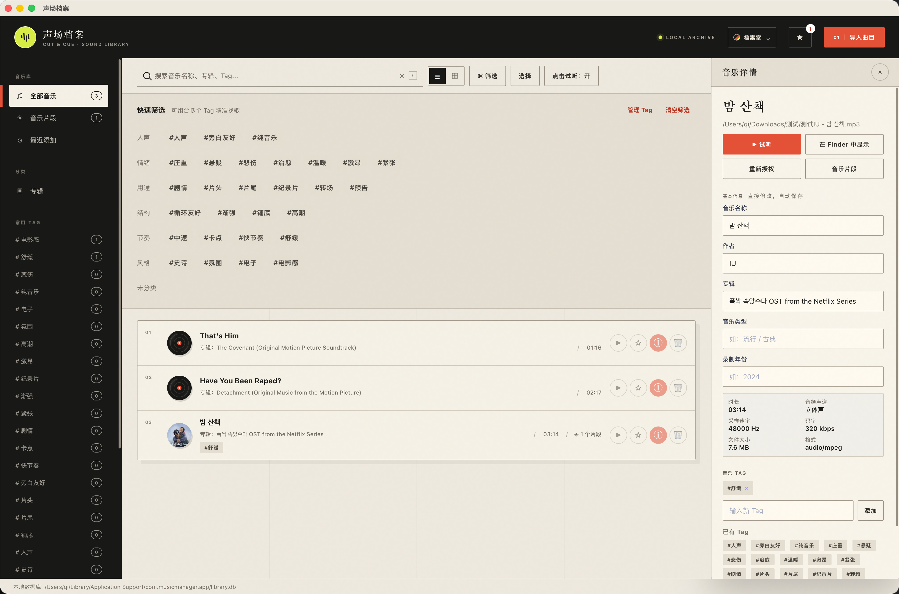
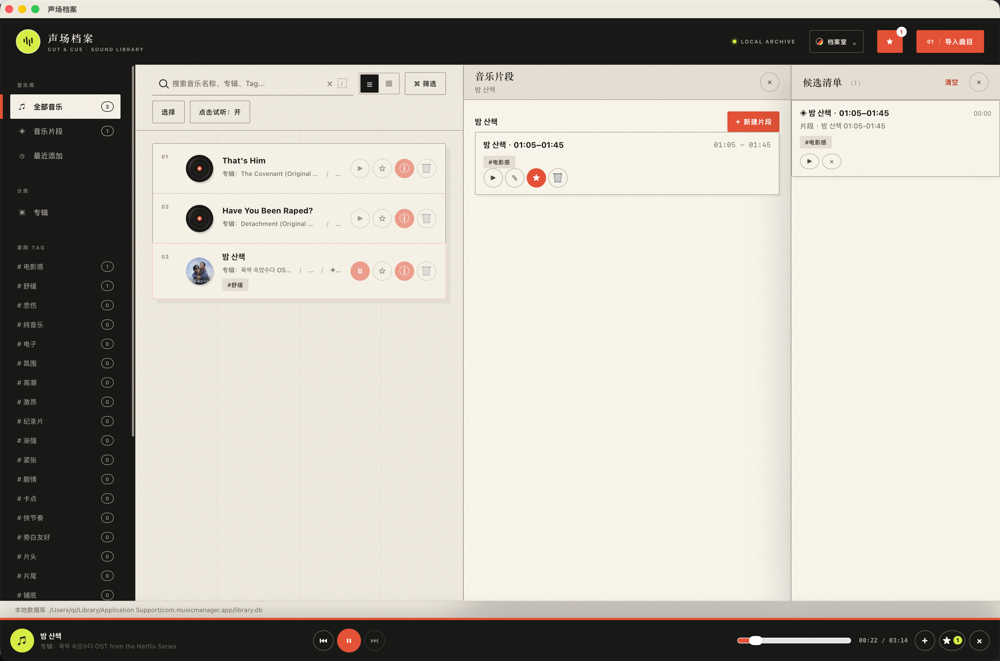
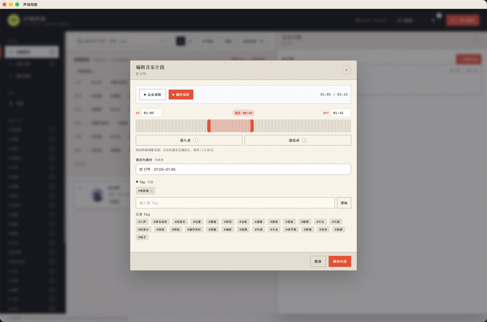

# 声场档案

本地音乐素材管理工具 —— 为剪辑师设计,用来管理、检索、标记音乐素材和片段。

数据用 **SQLite** 存在你本机的应用数据目录(而不是浏览器缓存),**音频文件仍保存在你原来的位置**,应用只记录路径和元数据。清浏览器缓存、清 WebView 缓存都不会影响音乐库。

![技术栈: Tauri v2 + Rust + SQLite + 原生 JS]

## 功能

- **导入音乐**:从磁盘选择或拖入音频文件,自动读取时长,只记录元数据 + 文件路径(不复制文件)
- **多视图检索**:全部音乐 / 音乐片段 / 最近添加 / 专辑 / Tag
- **搜索**:按名称、专辑、Tag 全局搜索
- **标签系统**:给音乐和片段打 Tag,侧边栏常用 Tag 快速筛选
- **片段标记**:在时间轴上拖动起止点,给音乐某一段做标记、命名、打 Tag
- **底部播放器**:点音乐行即内联试听,支持上一首/下一首在列表内连续播放;可在 Finder 中定位原文件
- **候选暂存**:试听时点「＋」把中意的歌加入候选清单,回头统一对比
- **文件重绑**:音乐文件被移动/改名后,可重新选择并绑定新路径

## 界面预览

### 音乐库、筛选与详情



### 底部播放器、音乐片段与候选清单



### 在时间轴中标记音乐片段



## 给使用者的说明(不需要装任何环境)

> 如果你是剪辑师朋友、完全不碰代码 —— 这部分就够了。

你收到的是一个 `.dmg` 安装包，**不需要安装 Node、Rust 或任何开发环境**。当前版本尚未进行 Apple 签名和公证；因此从浏览器下载后，macOS 可能会阻止直接打开。

### 安装与打开

1. 双击 `.dmg`，把「声场档案」拖进「应用程序」。
2. 请按 Mac 芯片选择 DMG：M1/M2/M3/M4 下载文件名含 `aarch64` 的版本；Intel Mac 下载文件名含 `x64` 的版本。若 macOS 显示“已损坏”或阻止打开，请从同一个 GitHub Release 一并下载 `install-macos.sh`，然后在终端运行（DMG 路径按实际下载位置填写）：
   ```bash
   bash "$HOME/Downloads/install-macos.sh" "$HOME/Downloads/声场档案_0.1.0_aarch64.dmg"
   ```
   脚本会校验 DMG、复制应用并移除**该应用**的下载隔离标记；它会要求输入 Mac 管理员密码。
   已有旧版本时，在命令末尾加 `--replace`。
   ```bash
   bash "$HOME/Downloads/install-macos.sh" "$HOME/Downloads/声场档案_0.1.0_aarch64.dmg" --replace
   ```
3. 打开后点击右上角 **「＋ 导入音乐」**,选择或拖入你的音频文件。

> 这是小范围测试的临时安装方式。未签名应用无法保证在所有 macOS 设置下都能无提示安装；正式发布仍需要 Apple Developer ID 签名与公证。

### 数据存在哪里

- 数据库文件:`~/Library/Application Support/com.musicmanager.app/library.db`
- **音频文件不复制、不移动**,还在你原来的文件夹里
- 音乐库 = 元数据 + 音频文件的路径;删掉或移动了音频文件,列表里这条会提示文件不存在

### 注意

- 应用内删除音乐/片段 = 从音乐库移除记录,**不会删除磁盘上的音频文件**
- 清空浏览器缓存对应用数据**没有任何影响**

## 给开发者的说明

### 项目结构

```
music-manager/
├── frontend/                # 前端(原生 JS + HTML + CSS,零框架零构建)
│   ├── index.html           # 主界面(含底部播放器、候选面板)
│   ├── app.js               # 全部逻辑
│   └── style.css            # 样式
└── src-tauri/               # Tauri v2 桌面壳
    ├── src/
    │   ├── main.rs          # 入口
    │   ├── lib.rs           # Builder 组装、数据库 setup
    │   ├── db.rs            # SQLite 连接 / 建表 / WAL
    │   └── commands.rs      # 全部 #[tauri::command]
    ├── tauri.conf.json
    ├── Cargo.toml
    └── capabilities/
```

### 技术要点

- **后端**:Tauri v2 + Rust,`rusqlite`(bundled SQLite)存本地数据库
- **前端**:原生 JS,通过 `window.__TAURI__` 全局 API 调 `invoke`,不引入 npm 包
- **音频**:库只存绝对路径,播放/剪辑时用 `convertFileSrc` + asset 协议把本地文件喂给 `<audio>`(已验证 WKWebView 下 seek 正常)
- **数据库位置**:`app.path().app_data_dir()`,macOS 即 `~/Library/Application Support/com.musicmanager.app/library.db`
- **替换了原版 IndexedDB + File System Access API**:原版数据存浏览器、清缓存即丢,这是迁移为桌面应用的根本原因

### 环境要求

| 工具 | 版本 | 用途 |
|---|---|---|
| Rust | stable | 编译 Rust 侧 |
| [tauri-cli](https://github.com/tauri-apps/tauri) | 2.x | 开发/打包(`cargo install tauri-cli --locked`) |
| Xcode Command Line Tools | macOS | 编译 |

### 开发

```bash
# 安装 Rust(如果还没有)
curl --proto '=https' --tlsv1.2 -sSf https://sh.rustup.rs | sh
# 安装 tauri-cli
cargo install tauri-cli --locked

# 启动开发模式(首次编译较慢)
cd src-tauri && cargo tauri dev
```

改 `frontend/` 下的文件后,刷新应用即可看到(无热重载,手动刷新窗口)。

### 打包

> **发布新版本前先更新版本号**：在 `src-tauri/Cargo.toml` 中修改 `version`，例如发布 `v0.1.1` 时设为 `version = "0.1.1"`。打包生成的 dmg 会使用这个版本号；GitHub Release 的 Tag 则使用带 `v` 的 `v0.1.1`。

先确保装有两个 Mac 架构的 Rust 目标(仅需执行一次):

```bash
rustup target add aarch64-apple-darwin x86_64-apple-darwin
```

我们采用「分架构打两个包」的方式,分别打 Apple Silicon 版和 Intel 版:

```bash
# Apple Silicon (M1/M2/M3) 版
cd src-tauri && cargo tauri build --target aarch64-apple-darwin

# Intel 版
cd src-tauri && cargo tauri build --target x86_64-apple-darwin
```

产物:

| 命令 | app / dmg |
|---|---|
| `--target aarch64-apple-darwin` | `target/aarch64-apple-darwin/release/bundle/macos/声场档案.app`<br>`target/aarch64-apple-darwin/release/bundle/dmg/声场档案_0.1.0_aarch64.dmg` |
| `--target x86_64-apple-darwin` | `target/x86_64-apple-darwin/release/bundle/macos/声场档案.app`<br>`target/x86_64-apple-darwin/release/bundle/dmg/声场档案_0.1.0_x64.dmg` |

发给朋友时说一句:M 芯片的 Mac 装 `aarch64` 版、老 Intel 的装 `x64` 版。

> 备选:也可以打 Universal Binary(一个 dmg 通吃两种 Mac),`cargo tauri build --target universal-apple-darwin`,产物为 `声场档案_0.1.0_universal.dmg`,但体积约大一倍。我们默认用上面的分架构方式。

发布 GitHub Release 时，同时上传 `aarch64` 和 `x64` 两个 `.dmg`，以及仓库中的 `scripts/install-macos.sh`。未签名应用从浏览器下载后可能显示“已损坏”；按上方「给使用者的说明」运行安装脚本。要彻底免提示需 Apple 开发者账号签名与公证($99/年)。

### 常用命令(增删改查)

前端通过 `window.__TAURI__.core.invoke` 调用,完整清单见 `src-tauri/src/commands.rs`:

| 命令 | 作用 |
|---|---|
| `init_db` | 确认数据库就绪 |
| `probe_file` | 读取文件路径的元数据(名称/大小/mime) |
| `create_music` / `update_music` / `delete_music` / `get_music` / `list_music` | 音乐表 CRUD |
| `create_clip` / `update_clip` / `delete_clip` / `get_clip` / `list_clips` | 片段表 CRUD |
| `file_exists` | 判断音频文件是否还在 |

### 数据模型

数据库为 SQLite(文件 `library.db`,WAL 模式、外键开启),当前 `SCHEMA_VERSION = 8`,共 7 张表。所有 `*_at` 时间字段均为毫秒时间戳(INTEGER)。

**music**(主键 `id`,音乐元数据;只存路径,不存音频文件本身)

| 字段 | 类型 | 说明 |
|---|---|---|
| id | TEXT PK | `music_<时间戳>_<随机>` |
| name | TEXT NOT NULL | 音乐名 |
| file_name | TEXT NOT NULL DEFAULT '' | 完整文件名 |
| path | TEXT NOT NULL(唯一索引) | 音频文件**绝对路径** |
| album | TEXT DEFAULT '' | 专辑 |
| artist | TEXT DEFAULT '' | 艺术家 |
| genre | TEXT DEFAULT '' | 流派 |
| year | TEXT DEFAULT '' | 年份 |
| channels | TEXT DEFAULT '' | 声道(单声道/立体声) |
| sample_rate | INTEGER DEFAULT 0 | 采样率(Hz) |
| bitrate | INTEGER DEFAULT 0 | 码率(kbps) |
| duration | REAL DEFAULT 0 | 时长(秒) |
| file_size | INTEGER DEFAULT 0 | 文件大小(字节) |
| mime_type | TEXT DEFAULT '' | 音频 MIME |
| created_at / updated_at | INTEGER NOT NULL | ms 时间戳 |

索引:`name`、`album`、`artist`、`genre`、`year`、`created_at`、`path`(唯一)。

**clips**(主键 `id`,音乐片段;外键关联 music,级联删除)

| 字段 | 类型 | 说明 |
|---|---|---|
| id | TEXT PK | `clip_<时间戳>_<随机>` |
| music_id | TEXT NOT NULL FK→music(id) ON DELETE CASCADE | 所属音乐 |
| name | TEXT NOT NULL DEFAULT '未命名片段' | 片段名 |
| start | REAL NOT NULL CHECK(start >= 0) | 起点(秒) |
| end | REAL NOT NULL CHECK(end > start) | 终点(秒) |
| created_at / updated_at | INTEGER NOT NULL | ms 时间戳 |

索引:`music_id`、`created_at`。

**tags / tag_categories**(标签与分类)

`tags`:

| 字段 | 类型 | 说明 |
|---|---|---|
| id | INTEGER PK AUTOINCREMENT | 标签 id |
| name | TEXT NOT NULL UNIQUE COLLATE NOCASE | 标签名(不区分大小写) |
| category | TEXT NOT NULL DEFAULT '自定义' FK→tag_categories(name) | 所属分类 |
| created_at | INTEGER NOT NULL | ms 时间戳 |

`tag_categories`:

| 字段 | 类型 | 说明 |
|---|---|---|
| name | TEXT PK COLLATE NOCASE | 分类名 |
| created_at | INTEGER NOT NULL | ms 时间戳 |

**music_tags / clip_tags**(音乐/片段与标签的多对多关联)

| 表 | 字段 | 说明 |
|---|---|---|
| music_tags | (music_id FK→music CASCADE, tag_id FK→tags CASCADE, PK(music_id, tag_id)) | 音乐-标签关联 |
| clip_tags | (clip_id FK→clips CASCADE, tag_id FK→tags CASCADE, PK(clip_id, tag_id)) | 片段-标签关联 |

索引:两表均在 `tag_id` 上有索引。

**candidate_entries**(候选暂存,多态引用 music 或 clips)

| 字段 | 类型 | 说明 |
|---|---|---|
| target_id | TEXT PK | 目标 music/clips 的 id |
| kind | TEXT NOT NULL CHECK(kind IN ('music','clip')) | 目标类型 |
| created_at | INTEGER NOT NULL | ms 时间戳 |

> 通过触发器 `trg_music_candidate_cleanup` / `trg_clips_candidate_cleanup`,删除 music/clips 时自动清理对应候选记录。

## License

私有项目,仅供内部分发使用。
